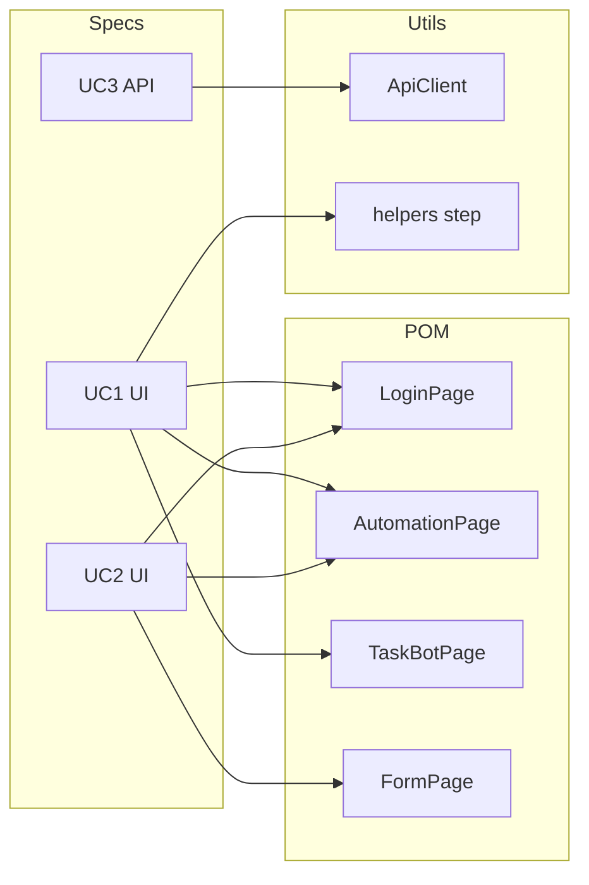

# Playwright · Automation Anywhere Community Edition

End-to-end and API automation for **Automation Anywhere Community Cloud** using **Playwright Test**, **JavaScript ES modules**, and a strict **Page Object Model (POM)**. Configuration is environment-driven (`dotenv`); UI flows favor accessible locators (`getByRole`, labels) with pragmatic fallbacks for tenant-specific markup.

---

## About the Project

| Item | Description |
|------|-------------|
| **What it tests** | Community Cloud UI (Task Bots, Forms) and Control Room–style REST APIs (learning instances). |
| **Framework** | Playwright Test (`@playwright/test`), ESM (`"type": "module"`). |
| **Pattern** | Page objects under `pages/`; specs under `tests/`; shared API client and helpers under `utils/`. |
| **Use cases** | **UC1** — Task Bot with Message Box (UI). **UC2** — Form builder, drag-drop controls, PDF upload (UI). **UC3** — Learning instance create/get and negatives (API). |

---

## Project structure

| Path | Role |
|------|------|
| `pages/LoginPage.js` | Login URL, credentials, cookie dismissal, logged-in landing checks. |
| `pages/AutomationPage.js` | Navigation into Automation (Task Bots, Forms) and “create new” entry points. |
| `pages/TaskBotPage.js` | Blank Task Bot creation, actions palette, Message Box on canvas, save, success assertions. |
| `pages/FormPage.js` | New form, React DnD–friendly drag to canvas (mouse simulation), file input, save. |
| `tests/ui/uc1-message-box.spec.js` | UC1 — **six** UI tests (TC-01 … TC-06): login, navigation, bot + canvas, Message Box, right panel, save with `step()` screenshots. |
| `tests/ui/uc2-form-upload.spec.js` | UC2 UI spec. |
| `tests/api/uc3-learning-instance.spec.js` | UC3 — **six** API tests including login/schema/negatives and **TC-19** performance (login and create each under 3000 ms). |
| `utils/apiClient.js` | HTTP login, learning instance POST/GET, schema validation, `elapsedMs` for perf assertions. |
| `utils/helpers.js` | `captureStepScreenshot`, **`step()`** (named step + screenshot), response-time and schema helpers. |
| `utils/globalSetup.js` | Report directories and global prep. |
| `config/env.config.js` | Loads `.env`, exposes `env` and credential guards. |
| `test-data/testData.js` | Shared prefixes and API payloads. |
| `test-data/generate-sample.js` | Builds `sample-upload.pdf` for UC2. |
| `playwright.config.js` | Projects: `chromium-ui`, `api`; reporters: **HTML + list + Allure**; traces, screenshots, video on failure. |
| `portal/` | **PulseFrame** static UI (Vite): premium landing + copy-to-clipboard test commands. |
| `.env.example` | Template for required variables. |

---

## Prerequisites

| Requirement | Notes |
|-------------|--------|
| **Node.js** | **18+** (ESM, stable `fetch` in tooling). |
| **npm** | Used for install and scripts. |
| **Git** | To clone the repository. |
| **Chromium** | Installed via `npx playwright install chromium` (used by UI and API projects). |

---

## Setup

1. **Clone** the repository and enter the project directory.

2. **Install dependencies:**

   ```bash
   npm install
   ```

3. **Environment file:** copy the example file and set secrets (never commit `.env`):

   ```bash
   copy .env.example .env
   ```

   On Unix-like systems: `cp .env.example .env`

  **Demo login configured for this project:**

  - Username: `harshitha`
  - Password: `harshitha21`

  If your tenant rejects demo credentials, replace with your active Automation Anywhere Community Edition account values in `.env`.

4. **Generate the PDF sample** (also runs automatically before `npm test` via `pretest`):

   ```bash
   npm run generate:pdf
   ```

5. **Install browsers:**

   ```bash
   npx playwright install chromium
   ```

---

## Running tests

| Command | Description |
|---------|-------------|
| `npm test` | Full suite (UI + API projects). `pretest` runs `generate:pdf` first. |
| `npm run test:ui` | UI project only (`chromium-ui`). |
| `npm run test:api` | API project only. |
| `npm run test:uc1` | UC1 only — `tests/ui/uc1-message-box.spec.js`. |
| `npm run test:uc2` | UC2 only — `tests/ui/uc2-form-upload.spec.js`. |
| `npm run test:uc3` | UC3 only — `tests/api/uc3-learning-instance.spec.js`. |
| `npm run test:headed` | UI tests in headed Chromium. |
| `npm run test:debug` | Playwright debug mode. |
| `npm run report` | Open the last HTML report (`playwright show-report`). |
| `npm run allure:generate` | Build Allure report from `allure-results/` → `allure-report/`. |
| `npm run allure:open` | Open generated Allure report (run generate first). |
| `npm run doctor` | Preflight: Node ≥18, required files, `.env` hint, PDF sample, `playwright test --list` (no secrets printed). |
| `npm run test:smoke` | Runs tests tagged **`@smoke`** — one UC1 login, UC2 main form flow, UC3 API login/token (fast sanity before full suite). |

---

## Local Demo Mode (Clone And Run)

Use this mode when you want a fully reproducible local demo without relying on a live Automation Anywhere tenant.

| Command | Description |
|---------|-------------|
| `npm run demo:start` | Starts local mock UI/API server at `http://127.0.0.1:3000`. |
| `npm run demo:smoke` | Runs UC1 + UC2 + UC3 smoke tests against local demo server. |
| `npm run demo:test:ui` | Runs full UI suite against local demo server. |
| `npm run demo:test:api` | Runs full API suite against local demo server. |

Demo credentials in local mode:

- Username: `harshitha`
- Password: `harshitha21`

---

## PulseFrame · portfolio UI (optional)

A **cinematic dark landing page** lives under `portal/` — brand name **PulseFrame** (original; not affiliated with Netflix). It is a **command-center** for reviewers: copy-paste terminal commands, UC1–UC3 shortcuts, and a short README hint. Visual language: glass panel, tilted "poster" grid (abstract gradients), **cyan–violet** accent (distinct from streaming red).

| Command | Description |
|---------|-------------|
| `npm run portal:dev` | Vite dev server (default **http://localhost:5174**). |
| `npm run portal:build` | Static build → `portal-dist/` (gitignored). |
| `npm run portal:preview` | Preview production build locally. |

### Portal Deployment

The `portal-dist/` folder contains the **pre-built static website** for the PulseFrame portal. To deploy:

1. **For GitHub Pages or static hosting:**
   - Upload the entire `portal-dist/` folder to your hosting provider
   - The `index.html` is the entry point

2. **To rebuild and deploy:**
   ```bash
   npm run portal:build
   # Deploy the contents of portal-dist/
   ```

**Note:** The `portal-dist/` folder is included in this submission for convenience. Run `npm run portal:build` after `npm install` to rebuild if needed.

**Other name ideas** (pick one for your README slide deck): *ArcVerify*, *Nexilis QA*, *Velocity Console*. Edit the wordmark in `portal/index.html` if you rebrand.

---

## Why this submission stands out

- **Three use cases with depth:** UC1 has six granular tests (TC-01 … TC-06) with `step()` screenshots; UC2 covers palette, canvas, properties panel, and PDF upload; UC3 includes schema checks, negatives, and **TC-19** performance (`elapsedMs` under 3000 ms on login and create).
- **Production-minded tooling:** Allure-ready reporters, `ApiClient` with typed `elapsedMs`, CI for API tests with artifact retention, and **`npm run doctor`** so reviewers verify the repo loads without guessing.
- **Smoke path:** `@smoke` tags give a **short** path (`npm run test:smoke`) for demos or pre-merge checks when full UI time is limited.



---

## Assertion matrix

| Test ID | Use case | Assertion (summary) |
|---------|----------|----------------------|
| TC-01 | UC1 | Login page: username + password visible, `type="password"`, post-login URL without `/login`, landing visible. |
| TC-02 | UC1 | Automation → Task Bots → Create; create flow UI visible. |
| TC-03 | UC1 | Blank Task Bot created; name value on control; editor canvas visible. |
| TC-04 | UC1 | Message Box added; configured message text visible. |
| TC-05 | UC1 | Message Box on canvas; right / properties panel visible. |
| TC-06 | UC1 | Full flow with **`step()`** screenshots per step; save; success toast/banner. |
| — | UC2 | Form canvas, palette, drags, right panel, file input, save success (single E2E). |
| TC-19 + others | UC3 | Login token, JSON content-type, token length over 10 chars; create/get id and name; **login and create each under 3000 ms**; negative auth and 4xx cases. |

---

## Framework architecture

- **Page Object Model (POM):** Each class under `pages/` takes a Playwright `Page` and exposes async methods for user-visible flows. Specs orchestrate pages and hold **expect** assertions; page objects avoid embedding test assertions in constructors and keep locators reusable.

- **Utils:** `apiClient.js` centralizes auth headers, URL joining, JSON parsing, and **`elapsedMs`** on login/create for performance checks. `helpers.js` provides **`step(page, name, fn)`** (logs the step, runs it, full-page screenshot under `playwright-report/screenshots/`), plus `captureStepScreenshot`, schema, and response-time helpers. `globalSetup.js` prepares reporting paths.

- **Data flow:** `config/env.config.js` reads process env (with defaults). UI tests use `BASE_URL`, `AA_USERNAME`, `AA_PASSWORD`. API tests use `AA_API_*` or fall back to UI credentials. `test-data/testData.js` supplies prefixes and learning-instance payloads; UC2 upload uses a generated PDF under `test-data/`.

---

## Environment variables

| Variable | Default | Purpose |
|----------|---------|---------|
| `BASE_URL` | `https://community.cloud.automationanywhere.digital` | Community Cloud UI base URL. |
| `AA_USERNAME` | `harshitha` | UI login username. |
| `AA_PASSWORD` | `harshitha21` | UI login password. |
| `HEADLESS` | `true` when not set to `false` | Run browser headless vs headed. |
| `AA_API_USERNAME` | falls back to `AA_USERNAME` | API login user. |
| `AA_API_PASSWORD` | falls back to `AA_PASSWORD` | API login password. |
| `AA_API_BASE` | falls back to `API_BASE_URL` / `BASE_URL` | Optional API host (alias per master guide / CI). |
| `API_BASE_URL` | falls back to `BASE_URL` | Optional separate API host. |
| `AA_LOGIN_PATH` | `/v2/authentication` | Login endpoint path (appended to API base). |
| `AA_LI_PATH` | `/iqbot/api/v2/learning-instances` if unset | Learning instances collection path; **your tenant may differ** (e.g. `/v1/learning/instances`) — set explicitly in `.env`. |

See `.env.example` for the demo-ready template used in this assignment setup.

---

## Verifying API URLs (DevTools Network tab)

`utils/apiClient.js` builds:

- **Login:** `{AA_API_BASE or API_BASE_URL or BASE_URL}` + `AA_LOGIN_PATH` — POST JSON body `{ username, password }` (see `buildLoginBody()`).
- **Learning instances:** same API root + `AA_LI_PATH` — POST create, GET `AA_LI_PATH/{id}`.

**You must confirm on your Automation Anywhere Community Cloud tenant:**

1. Open the site → **F12** → **Network** → preserve log.
2. **Login** — find the authentication **POST**; copy the path segment after the host into `AA_LOGIN_PATH`.
3. Open **Learning Instance** (or equivalent) — find **POST** (create) and **GET** by id; set `AA_LI_PATH` to the **collection** path only (no trailing id).
4. Check the login **response** for the token field name — `ApiClient` already checks `token`, `data.token`, `jwt`, `access_token`, etc.
5. Authorized calls use **`Authorization: Bearer <token>`** (`authHeaders()` in `apiClient.js`).

If paths differ from `.env.example`, update `.env` only (never commit it).

Payload shape for learning instances lives in `test-data/testData.js` — extend fields if your API requires more (e.g. groups).

---

## Known assumptions

- **Selectors** in `pages/*` match common Community Cloud patterns; tenants and builds differ—adjust locators if labels, `data-testid`, or class names change.
- **API** paths and JSON envelopes follow Control Room–style REST; tokens and entity ids may appear under `body`, `body.data`, or alternate keys—`ApiClient` and UC3 specs use nested extraction (e.g. `body?.id || body?.data?.id`).
- **React DnD:** Form controls are dragged with **sequential mouse move/down/up** in `FormPage.dragComponentToCanvas` (not `dragTo`), which is more reliable for HTML5/React DnD surfaces.
- **Credentials** are never committed; `.env` is gitignored.
- **Learning instance** POST bodies may need extra required fields for your tenant (groups, document types, etc.)—extend `test-data/testData.js` and payloads as needed.

---

## Reporting

- **Playwright HTML:** `playwright-report/index.html` — `npm run report`.
- **List** reporter in the terminal; failures retain traces, screenshots, and videos per `playwright.config.js`.
- **Allure:** Each run writes raw results to `allure-results/` (gitignored). After a run: `npm run allure:generate` then `npm run allure:open`. The `allure-commandline` package is included so no global Allure install is required.

---

## CI (GitHub Actions)

The workflow `.github/workflows/playwright.yml` includes:

1. **`preflight` job** — `npm ci` and **`npm run doctor`** (no GitHub secrets required): validates Node, files, and Playwright test discovery.
2. **`test` job** — **API tests only** (`--project=api`) on `push` / `pull_request` to `main`, **Node 20**, `ubuntu-latest`, `npx playwright install chromium --with-deps`.

**Secrets / env** (configure in the repo): `BASE_URL`, `AA_USERNAME`, `AA_PASSWORD`, `AA_API_USERNAME`, `AA_API_PASSWORD`, `AA_API_BASE`, `API_BASE_URL`, `AA_LOGIN_PATH`, `AA_LI_PATH`, and `HEADLESS=true`.

The **playwright-report** artifact uploads with **`if: always()`** and **retention-days: 7**.

UI tests are intended to run locally (`npm run test:ui`, `test:uc1`, `test:uc2`) against real AA CE credentials.

---

## Before you submit (ZIP or public GitHub)

Do **not** ship credentials or bulky folders.

| Step | Action |
|------|--------|
| 1 | **Delete `.env`** from the folder you zip (evaluators should only see `.env.example`). Recreate locally with `copy .env.example .env` when you run tests again. |
| 2 | **Delete `node_modules/`** — reinstall with `npm install` after clone. |
| 3 | **Delete generated artifacts** — `playwright-report/`, `test-results/`, `allure-results/`, `allure-report/` (all gitignored; safe to remove). |
| 4 | **Confirm** `.gitignore` contains `.env` (this repo does). |
| 5 | Run **`npx playwright test`** locally with a real `.env` until everything is green; fix selectors/API paths if needed. |
| 6 | Ensure **`test-data/sample-upload.pdf`** exists (`npm run generate:pdf` or `pretest` before `npm test`). |

The GitHub workflow (`.github/workflows/playwright.yml`) uses **repository Secrets**, not a committed `.env` file.

---

## Submission checklist

| Item | Notes |
|------|--------|
| UC1 | Six tests (TC-01 … TC-06) in `tests/ui/uc1-message-box.spec.js`. |
| UC2 / UC3 | Specs under `tests/ui` and `tests/api`; UC3 includes six API tests incl. TC-19. |
| POM + utils | `pages/*`, `utils/apiClient.js`, `utils/helpers.js` (`step`, screenshots). |
| Config | `playwright.config.js`, `config/env.config.js`, `utils/globalSetup.js`, `.env.example`. |
| Data | `test-data/sample-upload.pdf` via `npm run generate:pdf`. |
| Docs | This README; `.gitignore` includes `.env`, `allure-*`, artifacts. |
| CI | `.github/workflows/playwright.yml` — preflight + API tests; secrets in GitHub only. |
